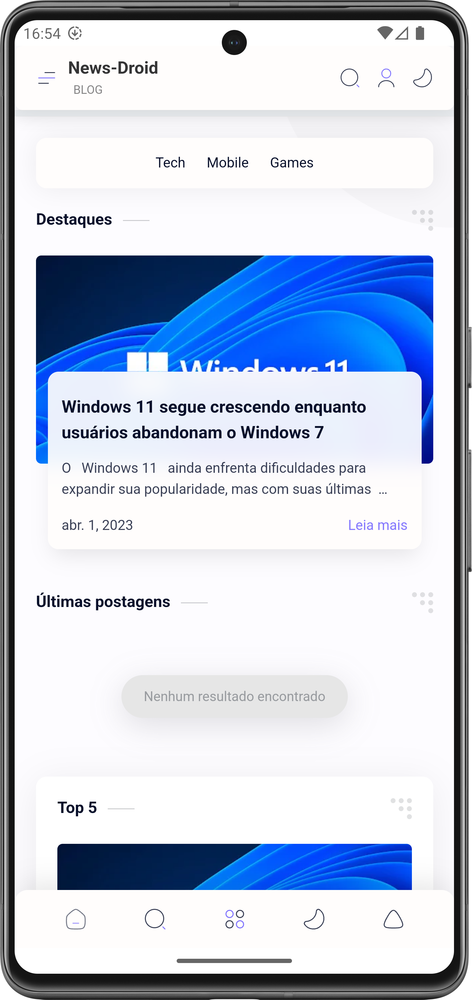
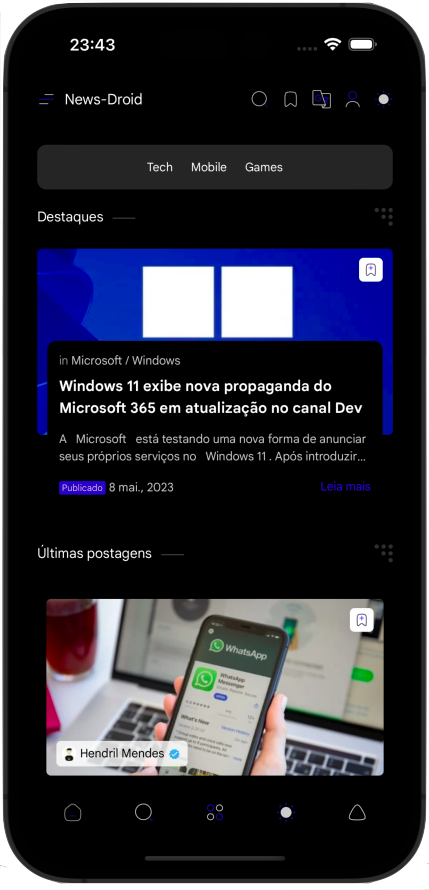

## News-Droid
Um app simples que utiliza webview para exibir um site de notícias. Um projeto que surgiu em 2017 mas que existe desde 2015 e aos pouquinhos esta tomando forma, quem sabe de certo né :)

### Screenshots

##

### Versão

##

### Recursos:

* App feito em Flutter, disponível para iOS, Android
* Firebase para monitorar o desempenho e erros do app
* OneSignal para envio de notificações
##

### Créditos também a:

<a href = "https://github.com/OneSignal" target="_blank">@OneSignal</a> 
<a href = "https://github.com/firebase" target="_blank">@Firebase</a> 
<a href = "https://github.com/pichillilorenzo" target="_blank">@Lorenzo Pichilli</a> 
<a href = "https://github.com/fluttercommunity" target="_blank">@Flutter Community</a>

 

Pelas bibliotecas maravilhosas que ajudou esse projeto ser possível.
